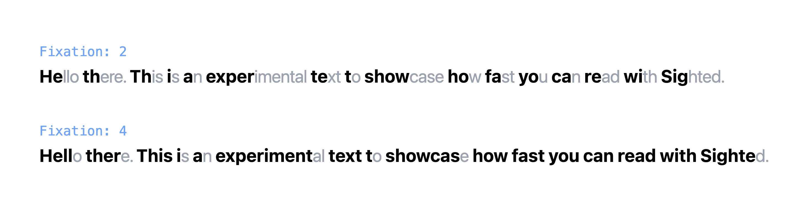
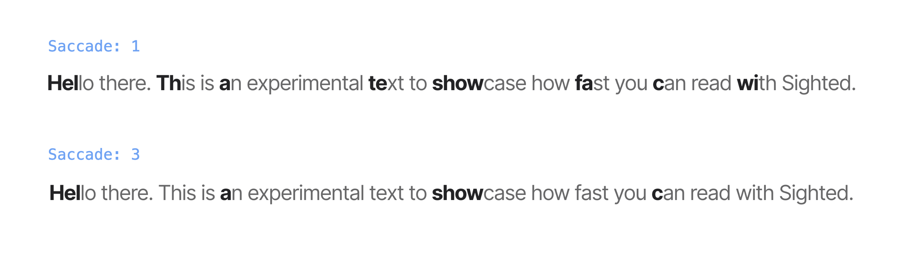
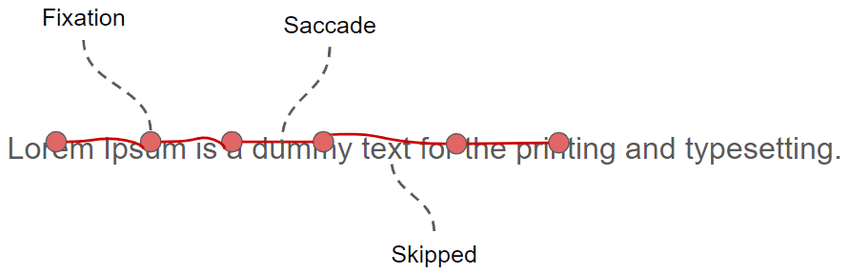

## Sighted - Your brain reads faster than your eyes!
Using NLP and bionic AI algorithms to help you stay focused and not get distracted when reading.

- [Sighted is LIVE here!](https://sighted.vercel.app)
- [See how Sighted can be helpful for individuals with Dyslexia and ADHD who love reading books!](#adhd--dyslexia)

### Installation
```sh
pip install sighted
```

Sighted uses a very light (~12Mb) pre-trained model that works perfectly fine with normal text inputs.

### Usage
```python
from sighted import Literal
from sighted.language import PoS

from string import Template


text = "Hello there. This is an experimental text to showcase \
        how fast you can read with Sighted."

language = Literal(
    text=text, 
    fixation=2,
    saccade=2,
    ignore_pos=[PoS.PUNCT]  # ignoring punctuations
)  

transformed_text = language.transform(
    template=Template(' <span class="$pos" id="$dep"><b>$fix</b>$unfix</span>')
)
```

The `transformed_text` is an iterable that contains the following items:

```html
<span class="intj" id="ROOT"><b>He</b>llo</span>
<span class="adv" id="advmod"><b>th</b>ere</span>
. <!-- Look how this punctuation is ignored -->
<span class="pron" id="nsubj"><b>Th</b>is</span>
<span class="aux" id="ROOT"><b>i</b>s</span>
<span class="det" id="det"><b>a</b>n</span>
<span class="adj" id="amod"><b>exper</b>imental</span>
<span class="noun" id="attr"><b>te</b>xt</span>
<span class="part" id="aux"><b>t</b>o</span>
<span class="verb" id="relcl"><b>show</b>case</span>
<span class="space" id="dep"><b>    </b>    </span>
<span class="sconj" id="advmod"><b>ho</b>w</span>
<span class="adv" id="advmod"><b>fa</b>st</span>
<span class="pron" id="nsubj"><b>yo</b>u</span>
<span class="aux" id="aux"><b>ca</b>n</span>
<span class="verb" id="ccomp"><b>re</b>ad</span>
<span class="adp" id="prep"><b>wi</b>th</span>
<span class="propn" id="pobj"><b>Sig</b>hted</span>
. <!-- Look how this punctuation is ignored -->
```

If you place this content within a `<p/>` tag in a very basic HTML `<body/>` structure, you'll have this kind of UI.


Since you have used `$pos` and `$dep` to set unique `class` and `id` to each word, you now have full control over their styling.

```css
/* unfixed letters */
p { color: gray; }

/* fixed letters */
b { color: black; }

/* adverbs */
.adv { border-bottom: solid 1px; }

/* pronouns */
.pron { color: red; }
.pron > b { color: purple; }

/* verbs */
.verb {
    background-color: yellow;
    padding: 3px;
    border-radius: 2px;
}
```

Now, you see how that basic CSS styling declaration has affected the text.


### Fixation
This parameter indicates how many first letters from each word should be considered as fixation. It's a value between 1 to 5. As you increase it, you see that the amount of fixed letters (bolded letters) will increase from the beginning of each word.



### Saccade
Saccades are rapid, involuntary eye movements that play a crucial role in reading by allowing the eyes to jump quickly from one word or section of text to another. In bionic reading, a technique designed to enhance reading efficiency, saccades are optimized by strategically highlighting certain letters or parts of words to guide the reader’s gaze. This method reduces the cognitive load on the brain by making it easier to recognize and process words, thereby improving reading speed and comprehension. By leveraging the natural mechanics of saccades, Sighted can make the reading experience smoother and more intuitive, particularly for individuals with reading difficulties.




Image credits: ResearchGate

### ADHD & Dyslexia
Sighted aids individuals with dyslexia by highlighting the first few letters of words, enhancing pattern recognition and reducing the cognitive effort needed for word decoding. For those with ADHD (Attention Deficit Hyperactivity Disorder), this technique helps maintain focus and improves reading fluency by guiding the eyes and reducing distractions within the text.

### License
MIT